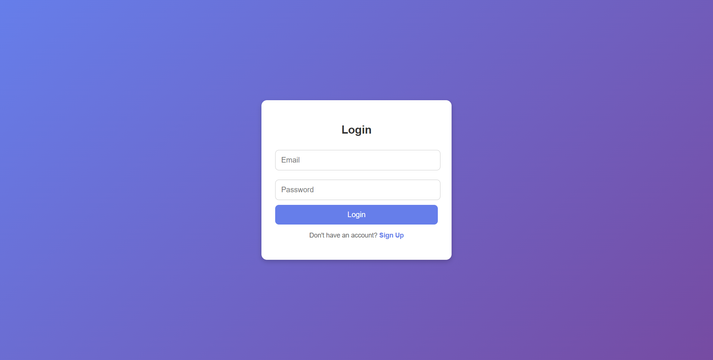

# Employee Management System

## Overview

The Employee Management System is a robust, secure, and feature-rich application designed to streamline employee data management, timesheet logging, and leave management. Built using .NET Core and following a multi-tiered architecture, the system leverages the Entity Framework Code-First approach for database interactions. The solution is designed to meet the needs of both regular employees and administrators, ensuring smooth day-to-day operations and efficient reporting.

## Key Features

### User Roles
- **Employee:** Manage personal details, timesheets, and leave requests.
- **Admin:** Full access to all employee profiles and timesheet entries; ability to manage accounts and generate reports.

### Employee Details Management
- Unique Employee ID for each user.
- Personal information including first name, last name, email, and phone number.
- Department association with support for multiple employees per department.
- Tech stack details reflecting skills and technologies.
- Optional fields: Date of birth and address.

### Timesheet Management
- Daily logging of working hours with date, start time, end time, and total hours.
- Optional work description to provide context for each entry.
- Capability for employees to view and edit their timesheet entries.

### Admin Capabilities
- Secure admin login with email and password.
- Comprehensive dashboard to view employee data and timesheets.
- Ability to export timesheet data to Excel for detailed reporting.
- Employee profile management, including editing details and account activation/deactivation.

### Additional Functionalities
- **Profile Management:** Employees can update key personal details, such as phone number, tech stack, and address. A secure password reset process is available via email verification.
- **Leave Management:** Employees can submit leave requests with start/end dates, type of leave (e.g., sick, casual, vacation), and an optional reason.
- **Reports & Analytics:** Admins can generate work hour reports on a weekly or monthly basis.

## Technical Architecture

- **Multi-Tiered Architecture:** Separates concerns into presentation, business, and data access layers to improve maintainability and scalability.
- **.NET Core API:** Ensures a performant, cross-platform solution.
- **Entity Framework (Code-First):** Simplifies database design and management while ensuring data integrity.
- **JWT Authentication:** Implements secure login and authorization for both employees and admins.
- **RESTful API Principles:** The API uses proper HTTP status codes and adheres to REST best practices.

## Basic Frontend Pages

### Login Page

---
### Admin Dashboard Page

---
### Employee Dashboard Page

---
## Setup and Installation

1. **Clone the Repository:**
   ```bash
   git clone https://github.com/yourusername/employee-management-system.git
   cd employee-management-system
   ```

2. **Configure the Environment:**
   - Update your `appsettings.json` with the appropriate database connection string.
   - Set any required JWT and email verification settings.

3. **Build and Run:**
   - Open the solution in your preferred IDE (e.g., Visual Studio or Visual Studio Code).
   - Restore NuGet packages and build the project.
   - Run the application using the .NET Core CLI:
     ```bash
     dotnet run
     ```

4. **Database Migration:**
   - Execute the following command to create/update your database:
     ```bash
     dotnet ef database update
     ```

Below is a sample API Endpoints section in Markdown that you can include in your GitHub repository’s README.md. This section concisely documents the available endpoints for your Auth, Admin, and Employee controllers without simply copying the source code:

---

## API Endpoints

This section provides an overview of the key API endpoints for the Employee Management System. The endpoints are grouped by functionality and secured according to the user role (public, authenticated, or admin).

---

### 1. Authentication Endpoints

#### Login
- **Method:** POST  
- **URL:** `/api/Auth/Login`  
- **Access:** Public  
- **Description:** Authenticates a user and returns a JWT token on successful login.  
- **Sample Request Body:**
  ```json
  {
    "email": "user@example.com",
    "password": "yourpassword"
  }
  ```
- **Responses:**
  - **200 OK:** Returns a JWT token.
  - **401 Unauthorized:** Invalid credentials.

#### Logout
- **Method:** POST  
- **URL:** `/api/Auth/Logout`  
- **Access:** Authenticated  
- **Description:** Logs out the user by invalidating the current token.  
- **Sample Request Body:**
  ```json
  "yourJWTToken"
  ```
- **Responses:**
  - **200 OK:** Logout confirmation.
  - **400/500:** Error handling for missing token or logout failure.

#### Reset Password (Logged In)
- **Method:** POST  
- **URL:** `/api/Auth/ResetPassword`  
- **Access:** Authenticated  
- **Description:** Resets the password for the authenticated user.  
- **Sample Request Body:**
  ```json
  {
    "email": "user@example.com",
    "oldPassword": "oldpassword",
    "newPassword": "newpassword"
  }
  ```
- **Responses:**
  - **200 OK:** Password reset confirmation.
  - **500 Internal Server Error:** Failure message.

#### Reset Password (Not Logged In)
- **Method:** POST  
- **URL:** `/api/Auth/ResetPasswordWhenNotLoggedIn`  
- **Access:** Public  
- **Description:** Initiates a password reset for users who are not logged in.  
- **Sample Request Body:**
  ```json
  "user@example.com"
  ```
- **Responses:**
  - **200 OK:** Instructions sent to email.
  - **404 Not Found:** Email not found.

#### Verify OTP & Reset Password
- **Method:** POST  
- **URL:** `/api/Auth/VerifyOTP`  
- **Access:** Public  
- **Description:** Verifies a one-time password (OTP) and, if valid, resets the password.  
- **Sample Request Body:**
  ```json
  {
    "email": "user@example.com",
    "enteredOTP": "123456",
    "newPassword": "newpassword"
  }
  ```
- **Responses:**
  - **200 OK:** Password reset success.
  - **400/500:** Invalid OTP or reset failure.

---

### 2. Admin Endpoints
*All admin endpoints require authentication with an admin role.*

#### Add Admin
- **Method:** POST  
- **URL:** `/api/Admin/Add`  
- **Description:** Adds a new admin user.  
- **Sample Request Body:**
  ```json
  {
    "email": "admin@example.com",
    "password": "securepassword",
    "role": "Admin",
    "otherDetails": "Optional additional details"
  }
  ```
- **Responses:**
  - **201 Created:** Admin created successfully.
  - **Error Codes:** Returns appropriate status code with error message on failure.

#### Get Admin By Id
- **Method:** GET  
- **URL:** `/api/Admin/{id}`  
- **Description:** Retrieves details of an admin by their unique identifier.  
- **Responses:**
  - **200 OK:** Returns admin details.
  - **Error Codes:** If admin not found.

#### Update Admin
- **Method:** PUT  
- **URL:** `/api/Admin/Update/{id}`  
- **Description:** Updates the details of an existing admin.  
- **Sample Request Body:**
  ```json
  {
    "email": "updatedadmin@example.com",
    "password": "newsecurepassword",
    "otherDetails": "Updated details"
  }
  ```
- **Responses:**
  - **200 OK:** Admin details updated.
  - **Error Codes:** Returns error status on failure.

#### Get Employee Detail
- **Method:** GET  
- **URL:** `/api/Admin/getEmployeeDetail/{employeeEmail}`  
- **Description:** Retrieves detailed information about an employee using their email address.  
- **Responses:**
  - **200 OK:** Employee details returned.
  - **Error Codes:** Appropriate error message if not found.

#### Get Employee Pending Leave Requests
- **Method:** GET  
- **URL:** `/api/Admin/getEmployeePendingLeaveRequest/{employeeEmail}`  
- **Description:** Retrieves pending leave requests for a specified employee.  
- **Responses:**
  - **200 OK:** List of pending leave requests.
  - **Error Codes:** Returns error message if none are found.

#### Export Employee TimeSheet
- **Method:** GET  
- **URL:** `/api/Admin/exportEmployeeTimeSheet/{employeeEmail}`  
- **Description:** Exports the timesheet data of an employee as an Excel file.  
- **Responses:**
  - **200 OK:** Returns an Excel file for download.
  - **Error Codes:** Returns error message if export fails.

#### Generate Employee Work Report
- **Method:** POST  
- **URL:** `/api/Admin/generateEmployeeWorkReport`  
- **Description:** Generates a work report for an employee over a specified period.  
- **Sample Request Body:**
  ```json
  {
    "email": "employee@example.com",
    "startDate": "2025-01-01",
    "endDate": "2025-01-31"
  }
  ```
- **Responses:**
  - **200 OK:** Returns a PDF file of the work report.
  - **Error Codes:** Returns error message on failure.

---

### 3. Employee Endpoints
*All endpoints require user authentication.*

#### Add Employee
- **Method:** POST  
- **URL:** `/api/Employee/AddEmployee`  
- **Description:** Creates a new employee profile.  
- **Sample Request Body:**
  ```json
  {
    "firstName": "John",
    "lastName": "Doe",
    "email": "john.doe@example.com",
    "phoneNumber": "1234567890",
    "department": "IT",
    "techStack": "C#, .NET, SQL",
    "dateOfBirth": "1990-01-01",
    "address": "123 Main St"
  }
  ```
- **Responses:**
  - **200 OK:** Employee added successfully.
  - **Error Codes:** Returns validation or error message on failure.

#### Get All Employees
- **Method:** GET  
- **URL:** `/api/Employee/GetAllEmployees`  
- **Description:** Retrieves a list of all employees.  
- **Responses:**
  - **200 OK:** Array of employee objects.
  - **Error Codes:** 404 Not Found if no employees exist.

#### Get Employee By Id
- **Method:** GET  
- **URL:** `/api/Employee/GetEmployeeById/{id}`  
- **Description:** Retrieves detailed information about a specific employee.  
- **Responses:**
  - **200 OK:** Employee details.
  - **Error Codes:** 404 Not Found if employee does not exist.

#### Update Employee
- **Method:** PUT  
- **URL:** `/api/Employee/UpdateEmployee/{id}`  
- **Description:** Updates an existing employee’s profile.  
- **Sample Request Body:**
  ```json
  {
    "firstName": "Jane",
    "lastName": "Doe",
    "phoneNumber": "0987654321",
    "techStack": "C#, ASP.NET Core, Angular",
    "address": "456 Another St"
  }
  ```
- **Responses:**
  - **200 OK:** Confirmation of update.
  - **Error Codes:** 400 Bad Request if update fails.

#### Delete Employee
- **Method:** DELETE  
- **URL:** `/api/Employee/DeleteEmployee/{id}`  
- **Description:** Deletes an employee profile using the unique identifier.  
- **Responses:**
  - **200 OK:** Confirmation of deletion.
  - **Error Codes:** 404 Not Found if the employee does not exist.

Below is a comprehensive Markdown section for your API Endpoints that documents the Leave, TimeSheet, and Department controllers. You can include this section in your GitHub repository’s README.md file.

---

### 4. Leave Controller

#### Leave Request
- **Method:** POST  
- **URL:** `/api/Leave/LeaveRequest`  
- **Access:** Authenticated Users  
- **Description:** Submits a new leave request for an employee.  
- **Request Payload:**
  ```json
  {
    "employeeId": 1,
    "startDate": "2025-03-01",
    "endDate": "2025-03-05",
    "leaveType": "Sick",
    "reason": "Medical leave"
  }
  ```
- **Responses:**
  - **200 OK:** Leave request submitted successfully.
  - **400 Bad Request:** Validation errors or submission failure.

#### Get All Leaves of Employee
- **Method:** GET  
- **URL:** `/api/Leave/GetAllLeavesOfEmployee/{employeeId}`  
- **Access:** Authenticated Users  
- **Description:** Retrieves all leave requests for the specified employee.  
- **Responses:**
  - **200 OK:** List of leave requests.
  - **404 Not Found:** No leave records found.

#### Approve or Reject Leave
- **Method:** PUT  
- **URL:** `/api/Leave/ApproveOrRejectLeave/{leaveId}`  
- **Access:** Admin (requires admin role)  
- **Description:** Approves or rejects a specific leave request.  
- **Request Payload:**
  ```json
  {
    "isApproved": true,
    "remarks": "Approved due to valid medical documentation"
  }
  ```
- **Responses:**
  - **200 OK:** Leave request updated successfully.
  - **400 Bad Request:** Update failed due to invalid data.

#### Delete Leave Request
- **Method:** DELETE  
- **URL:** `/api/Leave/DeleteLeaveRequest/{leaveId}`  
- **Access:** Authenticated Users  
- **Description:** Deletes a leave request identified by its ID.  
- **Responses:**
  - **200 OK:** Leave request deleted successfully.
  - **404 Not Found:** No leave request found with the provided ID.

---

### 5. TimeSheet Controller

#### Add TimeSheet
- **Method:** POST  
- **URL:** `/api/TimeSheet/AddTimeSheet`  
- **Access:** Authenticated Users  
- **Description:** Logs a new timesheet entry for an employee.  
- **Request Payload:**
  ```json
  {
    "employeeId": 1,
    "date": "2025-03-15",
    "startTime": "09:00",
    "endTime": "17:00",
    "totalHours": 8,
    "description": "Worked on project tasks"
  }
  ```
- **Responses:**
  - **200 OK:** Timesheet entry added successfully.
  - **400 Bad Request:** Validation errors.

#### Get All TimeSheets of Employee
- **Method:** GET  
- **URL:** `/api/TimeSheet/GetAllTimeSheetsOfEmployee/{employeeId}`  
- **Access:** Authenticated Users  
- **Description:** Retrieves all timesheet entries for a specific employee.  
- **Responses:**
  - **200 OK:** List of timesheet entries.
  - **404 Not Found:** No timesheet records found.

#### Update TimeSheet
- **Method:** PUT  
- **URL:** `/api/TimeSheet/UpdateTimeSheet/{id}`  
- **Access:** Admin (requires admin role)  
- **Description:** Updates an existing timesheet entry.  
- **Request Payload:**
  ```json
  {
    "date": "2025-03-15",
    "startTime": "09:30",
    "endTime": "17:30",
    "totalHours": 8,
    "description": "Updated work details"
  }
  ```
- **Responses:**
  - **200 OK:** Timesheet updated successfully.
  - **400 Bad Request:** Update failure due to invalid data.

#### Delete TimeSheet
- **Method:** DELETE  
- **URL:** `/api/TimeSheet/DeleteTimeSheet/{id}`  
- **Access:** Authenticated Users  
- **Description:** Deletes a timesheet entry identified by its ID.  
- **Responses:**
  - **200 OK:** Timesheet deleted successfully.
  - **404 Not Found:** No timesheet entry found with the provided ID.

---

### 6. Department Controller

#### Add Department
- **Method:** POST  
- **URL:** `/api/Department/Add`  
- **Access:** Admin (requires admin role)  
- **Description:** Creates a new department in the system.  
- **Request Payload:**
  ```json
  {
    "name": "Human Resources",
    "description": "Handles recruitment and employee welfare"
  }
  ```
- **Responses:**
  - **201 Created:** Department added successfully.
  - **Error Codes:** Returns an error message if creation fails.

#### Get All Departments
- **Method:** GET  
- **URL:** `/api/Department/GetAll`  
- **Access:** Admin (requires admin role)  
- **Description:** Retrieves a list of all departments.  
- **Responses:**
  - **200 OK:** List of departments.
  - **Error Codes:** Appropriate error message if no departments are found.

#### Get Department By Id
- **Method:** GET  
- **URL:** `/api/Department/{id}`  
- **Access:** Public  
- **Description:** Retrieves details of a department by its ID.  
- **Responses:**
  - **200 OK:** Department details.
  - **Error Codes:** Returns an error message if the department is not found.

#### Update Department
- **Method:** PUT  
- **URL:** `/api/Department/Update/{id}`  
- **Access:** Admin (requires admin role)  
- **Description:** Updates the details of an existing department.  
- **Request Payload:**
  ```json
  {
    "name": "Updated Department Name",
    "description": "Updated department description"
  }
  ```
- **Responses:**
  - **200 OK:** Department updated successfully.
  - **Error Codes:** Returns an error message if the update fails.


## Security and Authentication

- **User Authentication:** Both employees and admins log in using their email and a securely hashed password.
- **JWT Authentication:** Provides token-based security for API access, ensuring that only authenticated users can access protected routes.
- **Password Management:** Users can securely reset their passwords via email verification.
